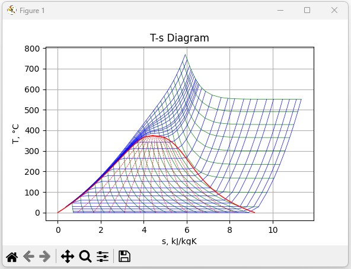

# SEUIF97

  [](https://github.com/thermalogic/RustSEUIF97/actions/workflows/rust.yml) 

[](https://doi.org/10.5281/zenodo.8239481)

The high-speed IAPWS-IF97 package is the Rust implementation of `seuif97` with C and Python binding. It is suitable for computation-intensive calculations，such as heat cycle calculations, simulations of non-stationary processes, real-time process monitoring and optimizations.
 
Through the high-speed package, the results of the IAPWS-IF97 are accurately produced at about 5-20x speed-up compared to  using the `powi()` of the Rust standard library in the `for`loop directly when computing the basic equations of Region 1,2,3.

**The Fast Methods**

1. The multi-step method unleashes the full power of the compiler optimizations while using `powi()` with the `for` loop
2. The recursive  method computes the polynomial values of the base variable and its derivatives

In the package, [36 thermodynamic, transport and  further properties](#properties) can be calculated. 

The following 12 input pairs are implemented: 

```txt
(p,t) (p,h) (p,s) (p,v) 

(t,h) (t,s) (t,v) 

(p,x) (t,x) (h,x) (s,x) 

(h,s)  
```

## Usage

Install the crate

```bash
cargo add seuif97
```

The type of functions are provided in the package:

```txt
struct o_id_region_args {
   o_id: i32,
   region: i32,
}

fn<R>(f64,f64,R) -> f64
where
    R: Into<o_id_region_args>,
```

* the first,second input parameters(f64) : the input propertry pairs
* the third and fourth input parametes<R>:
    * the third : the property ID of the calculated property - [o_id](#properties)
    * the fourth `option` parameter: the region of IAPWS-IF97
* the return(f64): the calculated property value of o_id

```txt
pt<R>(p:f64,t:f64,o_id_region:R)->f64
ph<R>(p:f64,h:f64,o_id_region:R)->f64
ps<R>(p:f64,s:f64,o_id_region:R)->f64
pv<R>(p:f64,v:f64,o_id_region:R)->f64

th<R>(t:f64,h:f64,o_id_region:R)->f64
ts<R>(t:f64,s:f64,o_id_region:R)->f64
tv<R>(t:f64,v:f64,o_id_region:R)->f64

hs<R>(h:f64,s:f64,o_id_region:R)->f64

px(p:f64,x:f64,o_id:i32)->f64
tx(p:f64,x:f64,o_id:i32)->f64
hx(h:f64,x:f64,o_id:i32)->f64
sx(s:f64,x:f64,o_id:i32)->f64

```
**Example**

```rust
use seuif97::*;
fn main() {
    
    let p:f64 = 3.0;
    let t:f64= 300.0-273.15;
   
    let h=pt(p,t,OH);
    let s=pt(p,t,OS);
    // set the region
    let v=pt(p,t,(OV,1));
    println!("p={p:.6} t={t:.6} h={t:.6} s={s:.6} v={v:.6}");   
}
```

## The C binding 

**Building the dynamic link library**

* cdecl

```bash
cargo build -r --features cdecl
```

* stdcall: Win32 API functions

```bash
cargo build -r --features stdcall
```

The convenient compiled dynamic link libraries are provided in the [./dynamic_lib/](./dynamic_lib/)

* `seuif97.dll`: [Windows64](./dynamic_lib/windows_x64/)  and [Windows32](./dynamic_lib/windows_x86/) 

* `libseuif97.so`: [Linux64](./dynamic_lib/linux_x64/)

**The functions in C**

```c
double pt(double p,double t,short o_id);
double ph(double p,double h,short o_id);
double ps(double p,double s,short o_id);
double pv(double p,double v,short o_id);

double tv(double t,double v,short o_id);
double th(double t,double h,short o_id);
double ts(double t,double s,short o_id);

double hs(double h,double s,short o_id);

double px(double p,double x,short o_id);
double tx(double t,double x,short o_id);
double hx(double h,double x,short o_id);
double sx(double s,double x,short o_id);
```

**Examples**

* [./demo_using_lib/](./demo_using_lib/): C, Python, C#, Excel VBA, Java, Fortran

```c
#include <stdlib.h>
#include <stdio.h>
#include <string.h>

#define OH 4
#define OS 5

extern double pt(double p,double t,short o_id);

int main(void)
{
    double p = 16.0;
    double t = 530.0;
    double h = pt(p, t, OH);
    double s = pt(p, t, OS);
    printf("p,t %f,%f h= %f s= %f\n", p, t, h, s);
    return EXIT_SUCCESS;
}
```

## The Python binding 

[](https://pepy.tech/project/seuif97) [](https://pepy.tech/project/seuif97)

**Install**

```bash
pip install seuif97
```

**Examples**

```python
from seuif97 import *

OH=4

p=16.0
t=535.1
# ??(in1,in2,o_id)
h=pt(p,t,OH)
# ??2?(in1,in2)
s=pt2s(p,t)
print(f"p={p}, t={t} h={h:.3f} s={s:.3f}")
```

**T-S Diagram**

* code: [./demo_using_lib/Diagram_T-S.py](./demo_using_lib/Diagram_T-S.py)


   
## Properties

| Propertry                             |    Unit     | Symbol | o_id  | o_id(i32)|
| ------------------------------------- | :---------: |:------:|------:|:--------:|
| Pressure                              |     MPa     |      p |   OP  |       0  |
| Temperature                           |     °C      |      t |   OT  |       1  |
| Density                               |   kg/m³     |      ρ |   OD  |       2  |
| Specific Volume                       |   m³/kg     |      v |   OV  |       3  |
| Specific enthalpy                     |    kJ/kg    |      h |   OH  |       4  |
| Specific entropy                      |  kJ/(kg·K)  |      s |   OS  |       5  |
| Specific exergy                       |    kJ/kg    |      e |   OE  |       6  |
| Specific internal energy              |    kJ/kg    |      u |   OU  |       7  |
| Specific isobaric heat capacity       |  kJ/(kg·K)  |     cp |  OCP  |       8  |
| Specific isochoric heat capacity      |  kJ/(kg·K)  |     cv |  OCV  |       9  |
| Speed of sound                        |     m/s     |      w |   OW  |       10 |
| Isentropic exponent                   |             |     k  |  OKS  |       11 |
| Specific Helmholtz free energy        |    kJ/kg    |     f  |   OF  |       12 |
| Specific Gibbs free energy            |    kJ/kg    |     g  |   OG  |       13 |
| Compressibility factor                |             |     z  |   OZ  |       14 |
| Steam quality                         |             |     x  |   OX  |       15 |
| Region                                |             |     r  |   OR  |       16 |
| Isobari cubic expansion coefficient   |     1/K     |   ɑv   |  OEC  |       17 |
| Isothermal compressibility            |    1/MPa    |    kT  |  OKT  |       18 |
| Partial derivative (∂V/∂T)p           |  m³/(kg·K)  |(∂V/∂T)p| ODVDT |       19 |
| Partial derivative (∂V/∂p)T           | m³/(kg·MPa) |(∂v/∂p)t| ODVDP |       20 |
| Partial derivative (∂P/∂T)v           |    MPa/K    |(∂p/∂t)v| ODPDT |       21 |
| Isothermal throttling coefficient     | kJ/(kg·MPa) |   δt   | OIJTC |       22 |
| Joule-Thomson coefficient             |    K/MPa    |    μ   | OJTC  |       23 |
| Dynamic viscosity                     |   Pa·s      |    η   |  ODV  |       24 |
| Kinematic viscosity                   |    m²/s     |    ν   |  OKV  |       25 |
| Thermal conductivity                  |   W/(m.K)   |    λ   |  OTC  |       26 |
| Thermal diffusivity                   |    m²/s     |    a   |  OTD  |       27 |
| Prandtl number                        |             |    Pr  |  OPR  |       28 |
| Surface tension                       |    N/m      |    σ   |  OST  |       29 |
| Static Dielectric Constant            |             |    ε   | OSDC  |       30 |
| Isochoric pressure coefficient        |    1/K      |    β   | OPC   |       31 |
| Isothermal stress coefficient         |   kg/m³     |    βp  | OBETAP|       32 |
| Fugacity coefficient                  |             |    fi  |   OFI |       33 |
| Fugacity                              |     MPa     |     f* |   OFU |       34 |
| Relative pressure coefficient         |     1/K     |    αp  | OAFLAP|        35|


