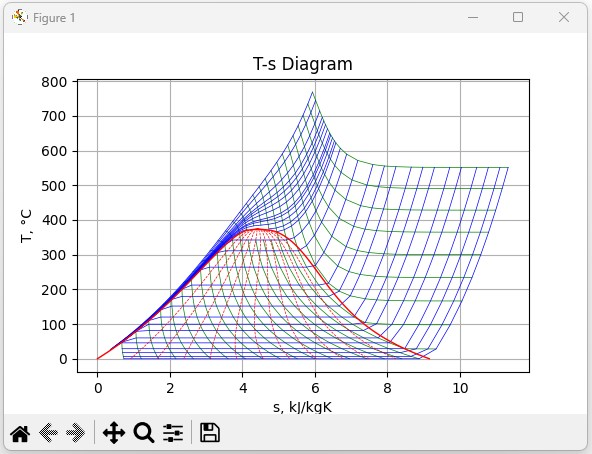

# SEUIF97

 [](https://github.com/thermalogic/RustSEUIF97/actions/workflows/rust.yml) 

This is the Rust implementation of the high-speed IAPWS-IF97 package **SEUIF97** with **C, Python and WASM** bindings. It is designed for computation-intensive tasks, such as simulating non-stationary processes, on-line process monitoring, and optimization.

SEUIF97 achieves a **5-20x** speedup over naive implementations that use the Rust standard library's `powi()` in `for` loops for the basic equations of Regions 1, 2, and 3.

This package supports **12 distinct input state pairs** for calculating **36 thermodynamic, transport, and derived properties** (see [Properties](#properties)), and **thermodynamic process functions** (see [Thermodynamic Process Functions](#thermodynamic-process-functions)).

## What's New in the Rust Version

The Rust version of SEUIF97 is a major upgrade over [the original C implementation](https://github.com/thermalogic/SEUIF97), delivering significant improvements in performance, functionality, and ecosystem support.

| Feature                               | C Version      | Rust Version               |
| ------------------------------------- | -------------- | -------------------------- |
| **Calculation Speed**                 | Baseline       | **~2× speedup**           |
| **Supported Properties**              | 30 properties  | **36 properties** (+6 new) |
| **Package Distribution**              | PyPI only      | **Crates.io, PyPI, npm**   |
| **Direct Property Functions**         | ✗              | **✓** (new)                |

For detailed comparison and key improvements, see [Rust vs C](./docs/RUST_VS_C.md).

## Acceleration Algorithms

The acceleration algorithms are detailed in paper: 
[Fast IAPWS-IF97 Evaluation: Profiling-Guided Loop Tiling and Shared-Power Scaling](https://doi.org/10.20944/preprints202606.0793.v1)

- **Profiling-guided loop tiling**: Partitions polynomial summation into cache-efficient tiles with empirically optimized boundaries to boost SIMD vectorization efficiency.
- **Shared-power scaling**: Leverages the mathematical correlation between Gibbs and Helmholtz free energy polynomials alongside their partial derivatives to evaluate all quantities in a single pass, removing redundant power-term computations.

For code examples, see: [Code Snippets for Acceleration Methods](./docs/code_snippets_acceleration_method.md)

## Performance Comparison with CoolProp IF97

SEUIF97 achieves **3-7x speedup** over [CoolProp IF97](https://github.com/CoolProp/IF97) in Region 1,2,and 3. Benchmarking code and data are available in the [bench_coolprop_if97](./bench_coolprop_if97/) directory.

## Property Calculation Functions

The package provides two types of API for property calculation.

### Universal Property Functions

The following 12 input pairs are implemented:

```bash
  (p,t), (p,h), (p,s), (p,v)
  (h,s)
  (t,h), (t,s), (t,v)
  (h,x), (t,x), (v,x), (s,x)
```            
Each function accepts an input pair, an output property ID ([o_id](#properties)), and an `optional` region parameter for faster computation.
For example: the input pair (p,t): `pt(p,t,o_id)`, `pt(p,t,(o_id,region))`

**Note:**
 * The `region` parameter is Rust-only. C, Python and WASM bindings support the `o_id` form only.
 * Only `linearly` related thermodynamic properties are calculable in the `wet` steam region.

### Direct Property Functions

Function naming convention: `{input1}{input2}2{output}`.

| Input | Outputs | Input | Outputs | Input | Outputs |
|-------|---------|-------|---------|-------|---------|
| (p,t) | h,s,v,x | (t,h) | p,s,v,x | (p,x) | t,h,s,v |
| (p,h) | t,s,v,x | (t,s) | p,h,v,x | (t,x) | p,h,s,v |
| (p,s) | t,h,v,x | (t,v) | p,h,s,x | (h,x) | p,t,s,v |
| (p,v) | t,h,s,x | (h,s) | p,t,v,x | (s,x) | p,t,h,v |

Total: 48 functions(e.g. `pt2h(p,t)`, `ph2t(p,h)`, `hs2p(h,s)`)

### Thermodynamic Process Functions

The following thermodynamic process functions are implemented:

- `ishd(pi, ti, pe)`: isentropic enthalpy drop for steam expansion (kJ/kg)
- `ief(pi, ti, pe, te)`: isentropic efficiency for superheated steam expansion (%)

## Install the crate

```bash
cargo add seuif97
```

## Usage

```rust
use seuif97::*;
fn main() {    
    let p: f64 = 3.0;
    let t: f64 = 300.0-273.15;
    // universal property function with o_id only
    let h = pt(p,t,OH);   
    // the funnction with o_id and region for faster calculation
    let s = pt(p,t,(OS,1)); 
    // direct property function
    let v = pt2v(p,t);

    println!("p={p:.6} t={t:.6} h={h:.6} s={s:.6} v={v:.6}");   

    // thermodynamic process function
    let pi: f64 = 16.0;
    let ti: f64 = 535.1;
    let pe: f64 = 5.0;
    let delta_h = ishd(pi, ti, pe);
    println!("ishd: pi={pi} ti={ti} pe={pe} delta_h={delta_h:.3}");
}
```

## C Shared Library

Pre-compiled dynamic link libraries for Windows, Linux and macOS are available in [GitHub Releases](https://github.com/thermalogic/RustSEUIF97/releases).

Interfaces and examples are provided in the [./demo\_using\_lib/](./demo_using_lib/) directory, supporting a wide range of languages and environments.

- C/C++, Python, C#, Java, Excel VBA, Rust, Fortran, Golang, JavaScript/TypeScript

```c
#include <stdlib.h>
#include <stdio.h>

#define OH 4

extern double pt(double p,double t,short o_id);
extern double pt2s(double p,double t);

int main(void)
{
    double p = 16.0;
    double t = 530.0;
    // universal property function with o_id only
    double h = pt(p, t, OH);
    // direct property function
    double s = pt2s(p, t);
    printf("p,t %f,%f h= %f s= %f\n", p, t, h, s);
    return EXIT_SUCCESS;
}
```

**Comprehensive Cross-language Examples**

- [The Rankine Cycle Steady-state Simulator in Python, C++, Rust and Modelica](https://github.com/thermalogic/SimRankine)

## Python binding

**Install from PyPI**

```bash
pip install seuif97
```

```python
from seuif97 import *

OH=4

p=16.0
t=535.1
# universal property function with o_id only
h=pt(p,t,OH)
# direct property function
s=pt2s(p,t)
print(f"p={p}, t={t} h={h:.3f} s={s:.3f}")
```

**Comprehensive Examples in Python**

- [T-S Diagram](./demo_using_lib/Diagram_T-S.py)
- [H-S Diagram](./demo_using_lib/Diagram_H-S.py)
- [H-S Diagram of Steam Turbine Expansion](./demo_using_lib/Turbine_H-S.py)
- [The Hybrid Steady-state Simulator of Rankine Cycle in Python](https://github.com/thermalogic/PyRankine)



## WASM binding

**Install from npm:**

```bash
npm install seuif97
```

- Detailed documentation: [README_WASM.md](./README_WASM.md)
- NPM package: [seuif97](https://www.npmjs.com/seuif97)

```javascript
import init, { pt, pt2s } from 'seuif97';

await init();

const p = 16.0;  // MPa
const t = 535.1; // °C
// universal property function with o_id only
const h = pt(p, t, 4);     // kJ/kg
// direct property function
const s = pt2s(p, t);      // kJ/(kg·K)

console.log('Properties at p = 16.0 MPa, t = 535.1 °C:');
console.log(`H: ${h.toFixed(3)} kJ/kg`);
console.log(`S: ${s.toFixed(5)} kJ/(kg·K)`);
```

## Properties

| Property                             |     Unit    |  Symbol  |  o\_id | o\_id(i32) |
| ------------------------------------ | :---------: | :------: | -----: | :--------: |
| Pressure                             |     MPa     |     p    |     OP |      0     |
| Temperature                          |      °C     |     t    |     OT |      1     |
| Density                              |    kg/m³    |     ρ    |     OD |      2     |
| Specific Volume                      |    m³/kg    |     v    |     OV |      3     |
| Specific enthalpy                    |    kJ/kg    |     h    |     OH |      4     |
| Specific entropy                     |  kJ/(kg·K)  |     s    |     OS |      5     |
| Specific exergy                      |    kJ/kg    |     e    |     OE |      6     |
| Specific internal energy             |    kJ/kg    |     u    |     OU |      7     |
| Specific isobaric heat capacity      |  kJ/(kg·K)  |    cp    |    OCP |      8     |
| Specific isochoric heat capacity     |  kJ/(kg·K)  |    cv    |    OCV |      9     |
| Speed of sound                       |     m/s     |     w    |     OW |     10     |
| Isentropic exponent                  |    —        |     k    |    OKS |     11     |
| Specific Helmholtz free energy       |    kJ/kg    |     f    |     OF |     12     |
| Specific Gibbs free energy           |    kJ/kg    |     g    |     OG |     13     |
| Compressibility factor               |    —        |     z    |     OZ |     14     |
| Steam quality                        |    —        |     x    |     OX |     15     |
| Region                               |    —        |     r    |     OR |     16     |
| Isobaric cubic expansion coefficient |     1/K     |    ɑv    |    OEC |     17     |
| Isothermal compressibility           |    1/MPa    |    kT    |    OKT |     18     |
| Partial derivative (∂v/∂T)p          |  m³/(kg·K)  | (∂v/∂T)p |  ODVDT |     19     |
| Partial derivative (∂v/∂p)T          | m³/(kg·MPa) | (∂v/∂p)T |  ODVDP |     20     |
| Partial derivative (∂p/∂T)v          |    MPa/K    | (∂p/∂T)v |  ODPDT |     21     |
| Isothermal throttling coefficient    | kJ/(kg·MPa) |    δt    |  OIJTC |     22     |
| Joule-Thomson coefficient            |    K/MPa    |     μ    |   OJTC |     23     |
| Dynamic viscosity                    |     Pa·s    |     η    |    ODV |     24     |
| Kinematic viscosity                  |     m²/s    |     ν    |    OKV |     25     |
| Thermal conductivity                 |   W/(m.K)   |     λ    |    OTC |     26     |
| Thermal diffusivity                  |     m²/s    |     a    |    OTD |     27     |
| Prandtl number                       |    —        |    Pr    |    OPR |     28     |
| Surface tension                      |     N/m     |     σ    |    OST |     29     |
| Static Dielectric Constant           |    —        |     ε    |   OSDC |     30     |
| Isochoric pressure coefficient       |     1/K     |     β    |    OPC |     31     |
| Isothermal stress coefficient        |    kg/m³    |    βp    | OBETAP |     32     |
| Fugacity coefficient                 |    —        |    φ    |    OFI |     33     |
| Fugacity                             |     MPa     |    f    |    OFU |     34     |
| Relative pressure coefficient        |     1/K     |    αp    | OAFLAP |     35     |
