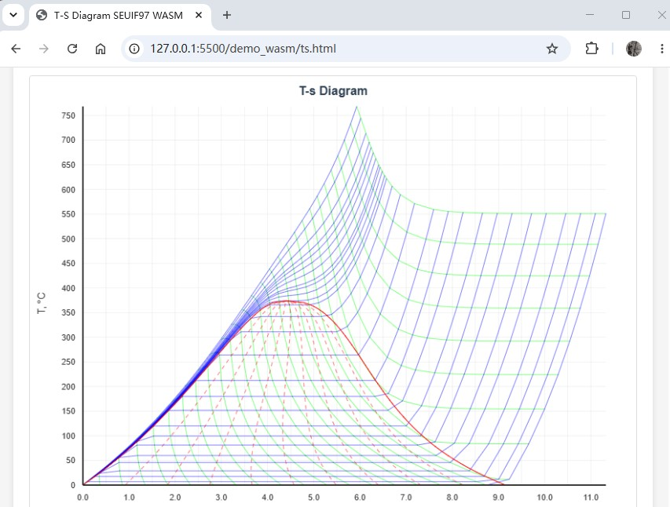

# The WASM and NPM Package  


The WebAssembly implementation of the high-speed IAPWS-IF97 package SEUIF97 in Rust, enabling fast and accurate thermodynamic property calculations for water and steam directly in the browser or Node.js. 

This package supports **12 distinct input state pairs** for calculating **36 thermodynamic, transport, and derived properties**.

## Building the WASM file

```bash
cargo build --release --features wasm --target wasm32-unknown-unknown
```

```bash
wasm-bindgen target/wasm32-unknown-unknown/release/seuif97.wasm --out-dir /demo_using_lib/demo_wasm/pkg --target web
```

## API Reference

The two types of API are provided in the package.

 1.  Universal Functions (with o_id parameter)
     - These functions accept an input property pair plus a property ID([o_id](#properties)) to calculate the desired output property. For example: `pt(p,t,o_id)`, where `o_id` is the property ID of the calculated property.

 2. Direct Property Functions
    -  These functions directly calculate a specific property `(p,t,h,s,v,x)`without requiring the property ID parameter. For example: `pt2h(p,t)`

### Basic Usage (ES Modules)

```javascript
import { pt } from './pkg/seuif97.js';
await init();

const p = 16.0;  // MPa
const t = 535.1; // °C

const h = pt(p, t, 4);

console.log(`p = ${p} MPa, t = ${t} °C`);
console.log(`h = ${h.toFixed(3)} kJ/kg`);
```
### Using in Web Browsers

* Example: [./demo_using_lib/demo_wasm](./demo_using_lib/demo_wasm/)

```bash
python -m http.server 8080
```

```
http://localhost:8080/
```

## Using in Node.js With NPM Package 

* NPM package: [seuif97](https://www.npmjs.com/seuif97)

```bash
npm install seuif97
```

* NPM Package example: [./demo_using_lib/demo_npm](./demo_using_lib/demo_npm/)

```javascript
import init, { pt2h } from 'seuif97';

await init();

const p = 3.0;    // MPa
const t = 250.0;  // °C

const h = pt2h(p, t);

console.log(`p = ${p} MPa, t = ${t} °C`);
console.log(`h = ${h.toFixed(5)} kJ/kg`);
```

## T-s Diagram


