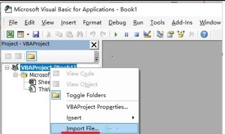
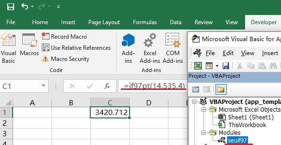

# Using SEUIF97 in Excel

## The Dynamic Library

### Build the stdcall Library for VBA

* stdcall: Windows API functions(64bit)

```bash
cargo build -r --features stdcall
```

* stdcall: Windows API functions(32bit) 
```bash
cargo build -r  --target=i686-pc-windows-msvc --features stdcall
```

###  Copy the Dynamic Library to the System Directory

Copy `seuif97.dll` to a system directory (e.g., `C:\Windows\System32` for 64-bit Windows).

Pre-compiled dynamic link libraries `seuif97.dll` are provided in the [./dynamic_lib/](../../dynamic_lib/)

* [windows_x64](../../dynamic_lib/windows_x64/) and [windows_x86](../../dynamic_lib/windows_x86/)


## Excel Workbook

Choose one of the following methods to set up your Excel workbook:

* Use the [app_template_seuif97.xlsm](./app_template_seuif97.xlsm) file, which already includes `seuif97.bas`, to start your work directly.

* Import `seuif97.bas` to the Excel workbook without macro</br></br>

   Press `ALT+F11`, then select `File` ->` Import File` and choose `seuif97.bas` from the file dialog.

  

   after that, use `seuif97` in the cells

  

